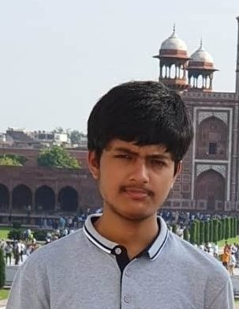

@def title = "Ashish Panigrahi"

@@displayPicture

@@

Hello there!

My name is Ashish Panigrahi. I'm a 4th year physics major studying under the Integrated Master's programme at the [National Institute of Science Education and Research](https://www.niser.ac.in) under [HBNI](http://www.hbni.ac.in/). My research interests lie in the experimental aspects of quantum technologies research ranging from quantum optics/information processing to cavity quantum-electrodynamics. I am actively seeking research internship opportunities for summer 2022.

I did my Bachelor's [thesis](assets/files/thesis.pdf) with [Dr. Kartik Senapati](https://www.niser.ac.in/users/kartik#profile-main)'s group on spin Hall effect in NM/HM trilayer systems in fall 2021 during which I became a [Qiskit advocate](https://qiskit.org/advocates/). You can find my full CV [here](assets/files/resume.pdf).

If you have any questions, suggestions, advice or simply wish to discuss about topics that relate to me, feel free to contact me via [email](mailto:ashish.panigrahi@niser.ac.in). See [here](contact/) for more detail.

<!-- For academic details, see my [CV](assets/files/resume.pdf). -->

### *Disclaimer*

The thoughts that I present in my blog are truly my own and do **not** represent the idealogy of the organization that I represent.

## Blog

_Thoughts on physics, society and technology._

{{recentblogposts}}
